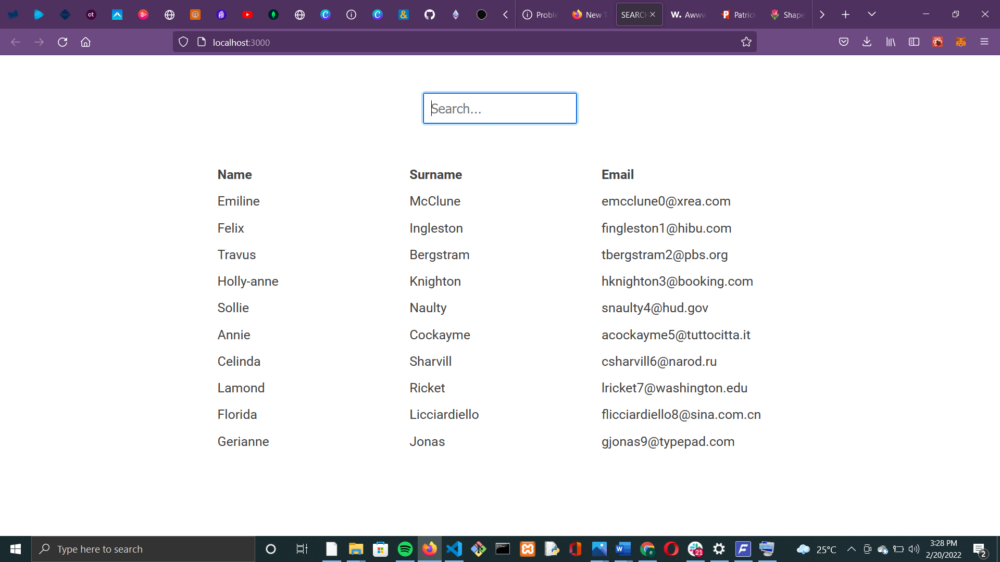
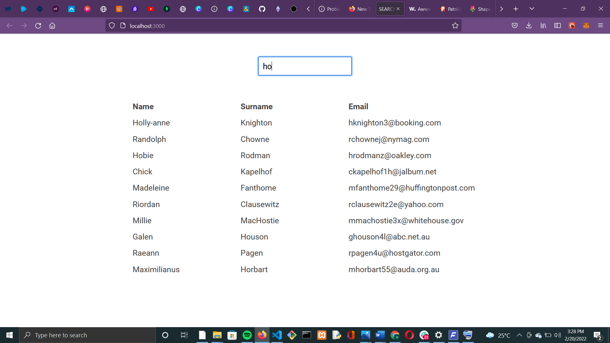
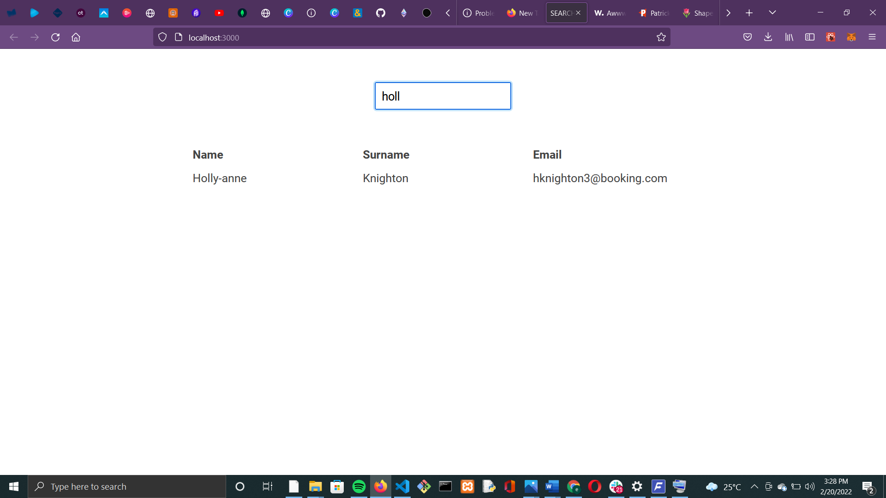

# Simple Search Engine

An implementation of a search engine in javascript.

#### Screenshot 1

 

#### Screenshot 2

#### Screenshot 3

#### Screenshot 4

## Running
This project requires Node v12 or higher.

1. Open terminal <kbd>Ctrl + Shift + `</kbd>.
2. cd api
3. Run `yarn install` 
4. Run `yarn start`
2. cd client
3. Run `yarn install` 
4. Run `yarn start` 
